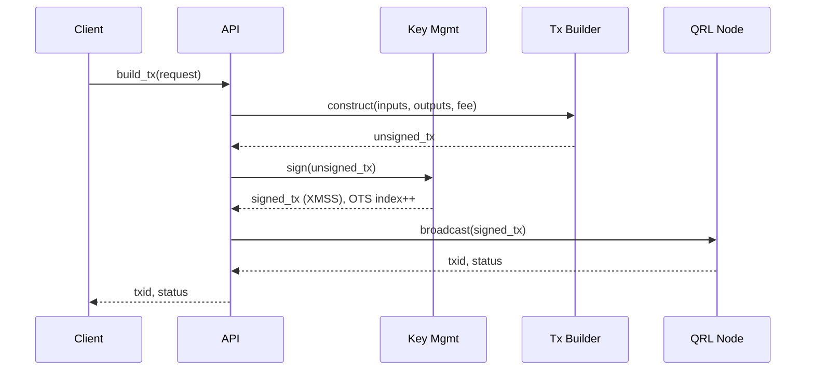

# QRL Wallet Whitepaper

## Abstract
This document outlines the design, threat model, and implementation plan for a production‑grade wallet built on top of the Quantum Resistant Ledger (QRL) libraries. It focuses on secure key management, deterministic transaction construction, API surfaces, and an automated CI pipeline that reliably ships prebuilt native dependencies (notably `pyqrllib`) to ensure reproducible builds across Linux CI.

## Goals
- Security‑first wallet with post‑quantum signatures via QRL primitives.
- Deterministic, testable transaction flows with clear invariants.
- Minimal, well‑specified public API (HTTP/WS) for application and service integration.
- Reproducible builds and tests in CI with prebuilt wheels to avoid source compilation flakiness.

## Non‑Goals
- Consensus, mining, or node implementation.
- On‑chain privacy features beyond standard QRL capabilities.
- GUI; the focus is programmatic and service APIs.

## Architecture Overview
- Core modules:
  - Key Management: seed derivation, mnemonic import/export, address generation.
  - Transaction: building, signing (XMSS), fee calculation, validation.
  - Networking: RPC/HTTP clients to QRL nodes/services, retry/backoff.
  - Storage: encrypted local keystore (optional KMS/HSM adapters).
  - API: Flask‑based service (`/api/*`) and WebSocket for event streaming.
- Libraries:
  - `pyqrllib==1.2.4` (prebuilt wheel in CI) for XMSS and primitives.
  - `grpcio`, `websockets`, and `flask` for API and communications.
- Tests:
  - Unit: key/transaction invariants and API handlers.
  - Integration: wallet send path (`tests/test_wallet_send.py`) and endpoints (`tests/test_api_endpoints.py`).

## Security Model
- Threats addressed:
  - Key theft at rest: encrypted keystore; hardware‑backed options (KMS/HSM) via adapters.
  - Key misuse: least‑privilege API, rate limiting, optional policy engine for transaction limits.
  - Memory disclosure: minimize secret residency, zeroization where feasible.
  - Build integrity: CI builds native wheels in a clean environment; artifacts are version‑pinned.
- Assumptions:
  - Trusted OS/kernel on the host where keys are stored.
  - TLS in transit; certificate pinning supported for clients.
  - Supply chain risks mitigated via dependency pinning and CI artifacts.

## Key Management
- Seed formats: raw entropy, mnemonic import/export (BIP‑style mnemonics where applicable), deterministic address generation.
- Backup/restore: out‑of‑band encrypted backups; versioned key metadata.
- Access control: passphrase/PBKDF; optional environment or KMS wrapping.

## Transaction Model
- Deterministic construction: explicit inputs, outputs, fee selection; idempotent submission.
- Signing: XMSS via `pyqrllib`, single‑use OTS index management with safe rollover.
- Validation: local stateless checks followed by node validation.
- Error semantics: structured errors for nonce/fee/insufficient funds with retry hints.

## Networking
- Node connectivity: configurable endpoints, exponential backoff, jitter, and deadlines.
- Observability: structured logging, correlation IDs, metrics hooks.
- Webhooks/WS: event notifications for confirmations and OTS exhaustion thresholds.

## API Surface
- REST endpoints: wallet creation, address list, balances, build/sign/broadcast transaction, OTS index status.
- Auth: bearer tokens; optional mTLS for internal deployments.
- Versioning: `/v1/*` with clear deprecation policy.

## Storage
- Encrypted keystore on disk (AES‑GCM) with scrypt/argon2 key derivation.
- Pluggable secret stores: HashiCorp Vault, AWS KMS (future adapters).
- Data model: seed, XMSS indices, metadata and policy docs.

## CI/CD and Reproducible Builds
- GitHub Actions workflow `/.github/workflows/pytest.yml`:
  - Build job: prebuild `pyqrllib==1.2.4` wheel on Ubuntu, cache across runs, upload artifact.
  - Test job: installs prebuilt wheel, project deps, runs pytest with coverage; uploads `coverage.xml`.
  - Concurrency and timeouts to avoid stale runs and hangups.
  - Path filters to skip docs‑only changes.
  - Lint job using `pre-commit` (ruff, mypy, YAML checks), non‑blocking initially.
- Nightly prebuild `/.github/workflows/nightly-wheel.yml` to warm the wheel cache and publish artifacts.
- Coverage: Codecov integration publishes coverage reports (token required for private repos).

## Performance & Scalability
- Transaction throughput is constrained by node rate limits and network conditions.
- XMSS signing is sequential per key by design; parallelization is achieved across distinct keys/wallets. Use OTS index reservation to safely parallelize without index collisions.
- API horizontally scalable behind a load balancer; stateless components preferred.

## Privacy Considerations
- Address reuse warnings; OTS index monitoring to prevent signature reuse.
- Logs scrub PII/secret material; configurable retention.

## Roadmap
- Hardware wallet/KMS adapters.
- Expanded integration tests and fuzzing of transaction builders.
- Multi‑platform wheel publishing and signed release artifacts.
- Optional GUI wrapper and browser extension interfaces.

## Compliance & Operations
- Key handling SOPs and recovery runbooks.
- Dependency license review; SBOM generation.
- Incident response playbooks for key compromise or chain reorg anomalies.

## Risks
- Dependency risk in native code (`pyqrllib`); mitigated via pinning and prebuilt artifacts.
- Operational risks around OTS management; mitigated by monitoring and policies.

## System Overview Diagram

```mermaid
flowchart LR
  subgraph Client
    UI[App/Service]
  end
  subgraph Wallet
    API[Flask API / WS]
    KM[Key Management<br/>(Encrypted keystore)]
    TX[Transaction Builder/Signer]
    OTS[OTS Index Manager]
  end
  Node[QRL Node]

  UI -->|HTTP/WS| API
  API --> KM
  API --> TX
  TX --> OTS
  TX -->|gRPC/HTTP| Node
```

## Transaction Flow Diagram



## API Outline (v1)

- `POST /api/v1/wallets` Create wallet (seed, mnemonic, policy)
- `GET /api/v1/wallets/{id}` Wallet info (addresses, OTS status)
- `POST /api/v1/tx/build` Build unsigned transaction (deterministic)
- `POST /api/v1/tx/sign` Sign transaction (XMSS)
- `POST /api/v1/tx/broadcast` Broadcast signed transaction
- `GET /api/v1/tx/{txid}` Transaction status
- `WS /api/v1/events` Confirmations, OTS thresholds, alerts

Auth: bearer tokens; optional mTLS for internal deployments.

## Threat Model (Summary)
- Trust boundary: assumes a trustworthy host OS/kernel. In higher-assurance deployments consider TEEs (e.g., SGX/SEV/TDX) or HSM-backed keys. Residual risk remains for kernel/firmware compromise.
- Supply chain: mitigate via strict version pinning, artifact verification, and SBOM attestation. CI builds prebuilt wheels in a clean environment.
- DoS/abuse: rate limits and quotas on sensitive endpoints; bounded timeouts.
- Secrets in memory: minimize lifetime, avoid serialization, and prefer zeroization where feasible.
- Authentication/authorization: bearer tokens by default; mTLS is recommended for internal deployments.

## Idempotency & Retry Semantics

- Building is idempotent (deterministic inputs → deterministic unsigned transaction).
- Signing is stateful (XMSS consumes a unique OTS index per signature). Do not blindly re-sign on unknown broadcast results.
- Strategy:
  - Mark OTS index as "reserved" when signing starts. Persist a signed-tx record with OTS index, hash, TTL.
  - On retry, re-broadcast the same signed tx; never re-sign unless you explicitly abandon the prior attempt and consume a new OTS index.
  - If a fee-bump is required, it is a new transaction and must consume a new OTS index; explicitly deprecate the old tx.

## Nonce Management

- Maintain a per-address monotonic nonce allocated by a single writer (service) to avoid collisions in concurrent signing.
- Use a lightweight nonce allocator with optimistic locking (e.g., CAS on stored nonce + OTS index) and enqueue conflicting requests.
- On chain-reorg or failed broadcast, reconcile local nonce by querying the node and advancing local state carefully.

## Fee Strategy

- Modes:
  - Fixed: simple flat fee for predictable UX in test/dev.
  - Dynamic: function of mempool load and recent inclusion latency.
  - Priority tiers: economy/standard/priority mapped to internal fee multipliers.
- Surface fee recommendations via an endpoint (e.g., `/api/v1/fees`) and allow override with policy caps.

## Key Rotation & OTS Exhaustion Migration

- Triggers: OTS index threshold (e.g., 90% consumed), policy update, or compromise.
- Approach:
  - Use a deterministic master seed to derive new XMSS subtrees (versioned) and addresses; maintain an address map for receive-only legacy addresses.
  - Proactively rotate: begin using a new address when a threshold is hit; continue to monitor legacy addresses for inbound funds.
  - Migration flow:
    1. Generate new XMSS tree; persist metadata `{tree_version, created_at, height, starting_index}`.
    2. Update default send-from to new address; mark old tree as receive-only.
    3. Sweep remaining funds to the new address when policy allows and OTS capacity remains.
    4. Archive exhausted tree metadata (retain for validation/audit).
- UX: expose OTS health in UI/API and emit alerts well before exhaustion.

## Disaster Recovery & Backward Compatibility

- Backups: mnemonic/seed export plus encrypted metadata snapshot (tree versions, current indices, policy flags).
- Recovery flow: import mnemonic → reconstruct trees deterministically → restore index and policy from metadata; if metadata missing, rescan index from last known safe snapshot with guardrails.
- Schema evolution: version metadata files; on load, migrate forward with deterministic transformations; keep read-only fallback paths for N-1.

## Dependency Pinning & SBOM

- Use pinned versions (including transitive) via a lock workflow (e.g., pip-tools `pip-compile` with hashes or Poetry lock). Enforce `--require-hashes` in CI.
- Generate SBOM (CycloneDX) in CI and attach to releases; track license and vulnerability reports.
- Prebuilt `pyqrllib==1.2.4` wheel is cached and artifacted; consider signing artifacts in release pipeline.

## Privacy Trade-offs

- QRL ledger is transparent; transaction graphs are linkable. This wallet does not provide on-chain privacy (mixing, decoys, confidential amounts).
- Mitigations: address rotation, OTS monitoring to avoid reuse, and log scrubbing; they do not provide strong anonymity.

## Testing Strategy

- Property-based testing (e.g., Hypothesis) for transaction invariants (conservation, bounds, replay resistance).
- Fuzz API/serialization boundaries; adversarial tests for OTS index concurrency.
- Integration tests for end-to-end send flows and migration; periodic security reviews and static analysis.

## Multisig/Threshold Signatures

- Out of scope for v1. Institutional policies can be approximated via service-side policy engine (approvals, limits). Native XMSS multisig/aggregation is future work.

## Operations

- **[backups]** Encrypted seed backups; rotation SOPs; recovery drills.
- **[observability]** Structured logs, metrics hooks; alerts for OTS threshold, broadcast failures.
- **[incident response]** Key compromise runbook, node RPC degradation playbook.

## Data Retention & Privacy

- Minimize PII; store only wallet metadata/indices.
- Configurable log retention; secrets redaction filters.

## References
- QRL: https://theqrl.org/
- XMSS: RFC 8391 https://datatracker.ietf.org/doc/rfc8391/
- Codecov Action: https://github.com/codecov/codecov-action
- pre-commit: https://pre-commit.com/
